# Students App

Welcome to the Students App project repository! This project is a comprehensive system designed for managing quizzes, students, and statistics, developed using Java Swing. The application includes modules for both students and administrators to streamline the quiz management process.

## Features

### Student Modules
- **Registration:** Register with details such as name, email, password, student ID, mobile number, gender, security questions, and answers.
- **Login:** Secure login for students.
- **Forgot Password:** Recover password using security questions.
- **Home Page:** View available quizzes.
- **Start Quiz:** Instructions and quiz pages.
- **My Profile:** View quizzes taken with marks and update student information.
- **Statistics:** View performance statistics in a pie chart.
- **Logout:** Secure logout functionality.

### Admin Modules
- **Login:** Secure login for administrators.
- **Dashboard:** View counts of quizzes, questions, students, and batches.
- **Manage Students:** List, add, edit, and delete student records.
- **Manage Quiz:** List, create, edit, and delete quizzes.
- **Manage Questions:** List, create, edit, and delete questions.
- **Manage Batch:** List, add, edit, and delete batches.
- **Assign Quiz:** Assign quizzes to students or batches.
- **List of Ranking:** View overall and quiz-wise rankings.
- **Logout:** Secure logout functionality.

### Quiz Creation
- **Create Quiz:** Define quiz name, duration, start and end date, and assign to students or batches.
- **Create Question:** Add multiple-choice or true/false questions with correct answers.

## Getting Started

To set up and run the Students App on your local machine, follow these steps:

1. Clone this repository: `git clone https://github.com/YourUsername/Students-App.git`
2. Navigate to the project directory: `cd Students-App`
3. Open the project in your Java IDE (e.g., IntelliJ IDEA, Eclipse).
4. Run the application.

## Technologies Used

- **Java Swing:** For building the graphical user interface.
- **Java:** The primary programming language used.
- **SQLite/MySQL:** Database for storing application data.

## Screenshots

### 1. Student Registration
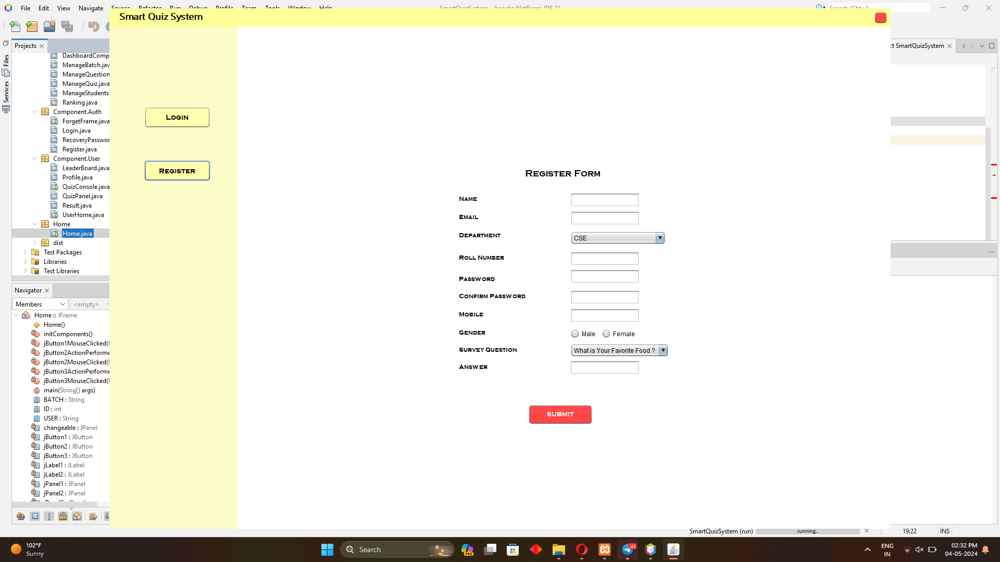

### 2. Student Login
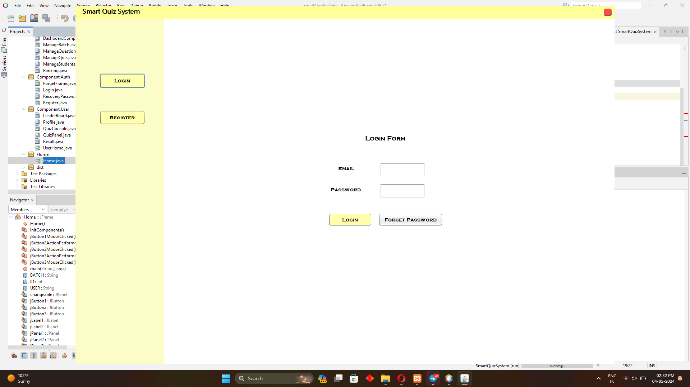

### 3. Home Page
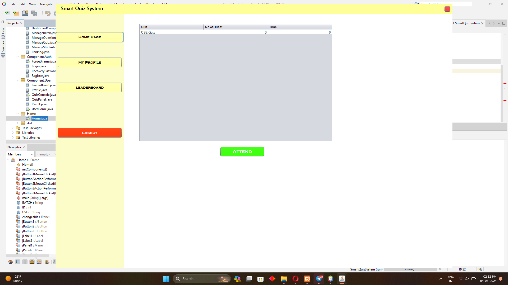

### 4. Start Quiz
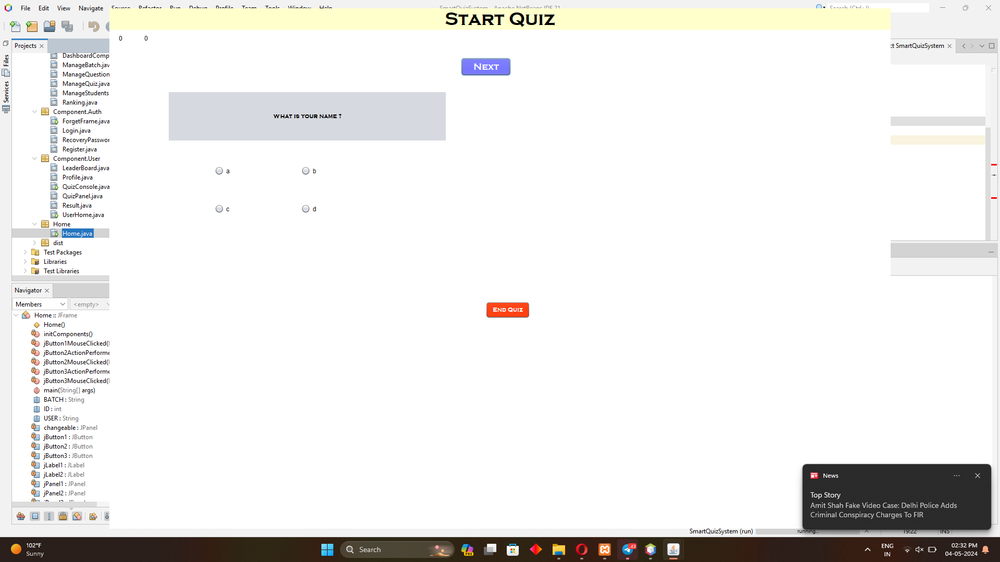

### 5. My Profile
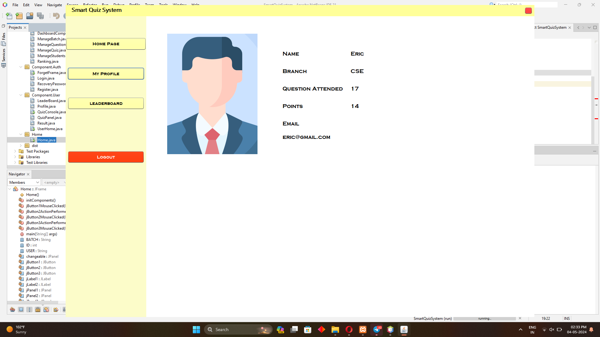

### 6. Admin Dashboard

### 7. Manage Students
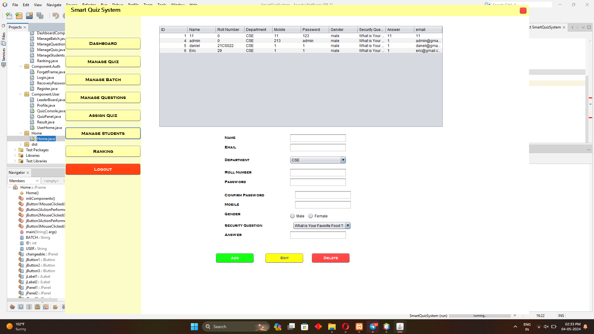

### 8. Manage Quiz
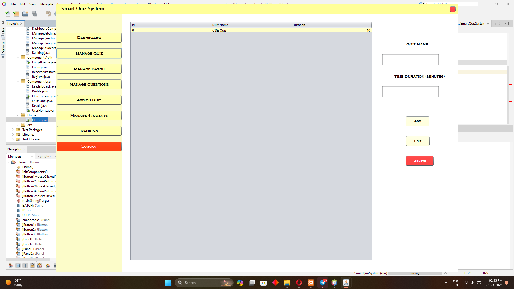

### 9. Manage Questions
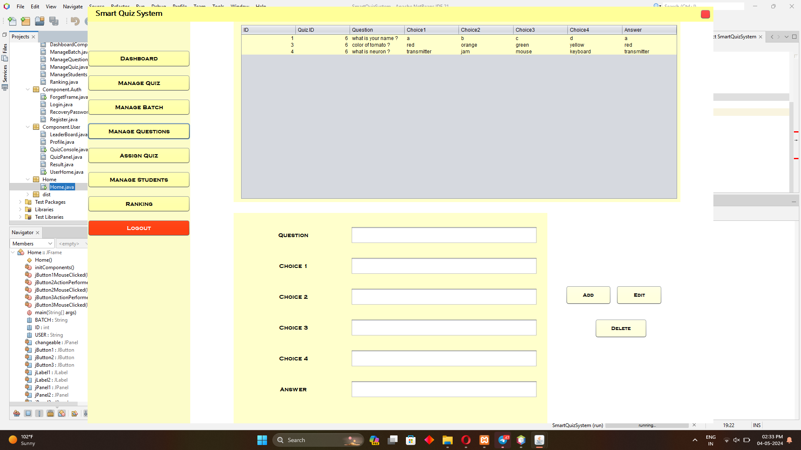

### 9. Manage Batch
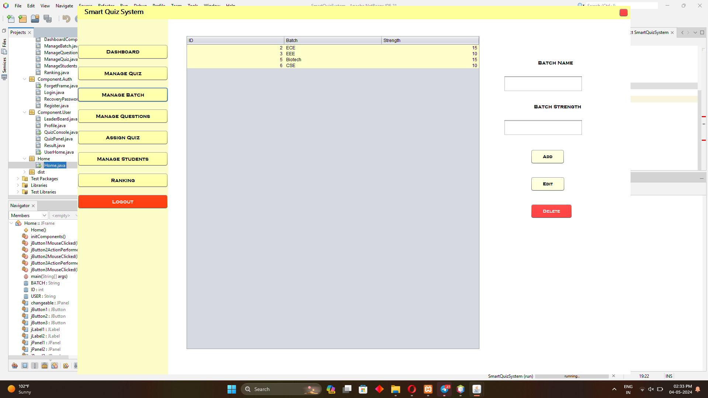

### 10. Assign Quiz
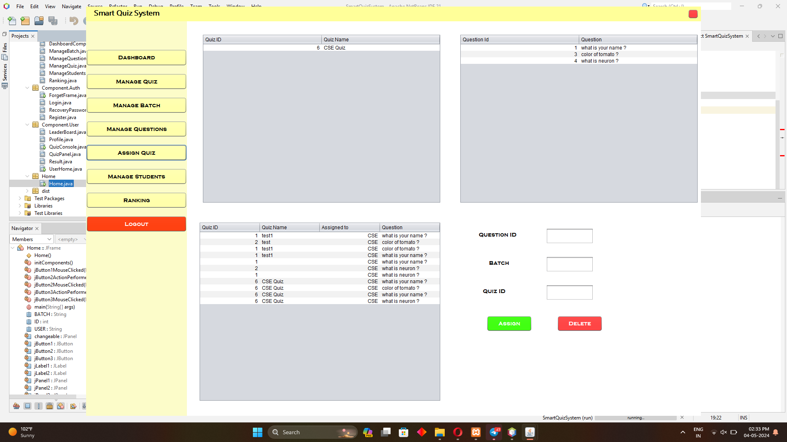

### 11. List of Ranking
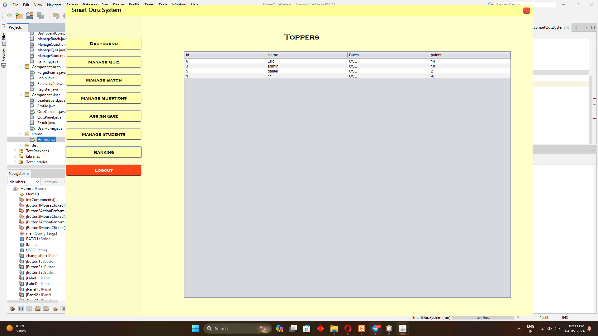

## Contributions

Contributions to enhance and improve the Students App are welcome. If you're interested in contributing, follow these steps:

1. Fork the repository.
2. Create a new branch for your feature or bug fix: `git checkout -b feature/your-feature-name`.
3. Make your changes and commit them: `git commit -m 'Add your feature'`.
4. Push to your branch: `git push origin feature/your-feature-name`.
5. Open a pull request.

## Feedback and Issues

We value your feedback and welcome bug reports or suggestions for improvement. If you encounter any issues or have ideas for enhancements, please [open an issue](https://github.com/YourUsername/Students-App/issues).

Thank you for exploring the Students App project! We hope it provides a robust solution for managing quizzes and student information efficiently.

